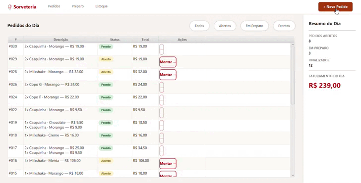
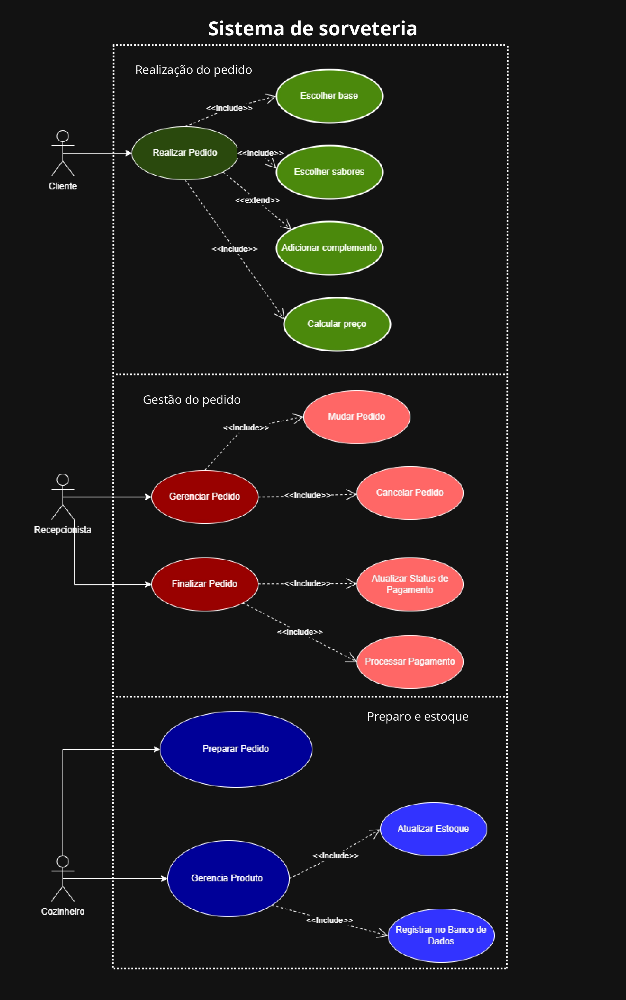
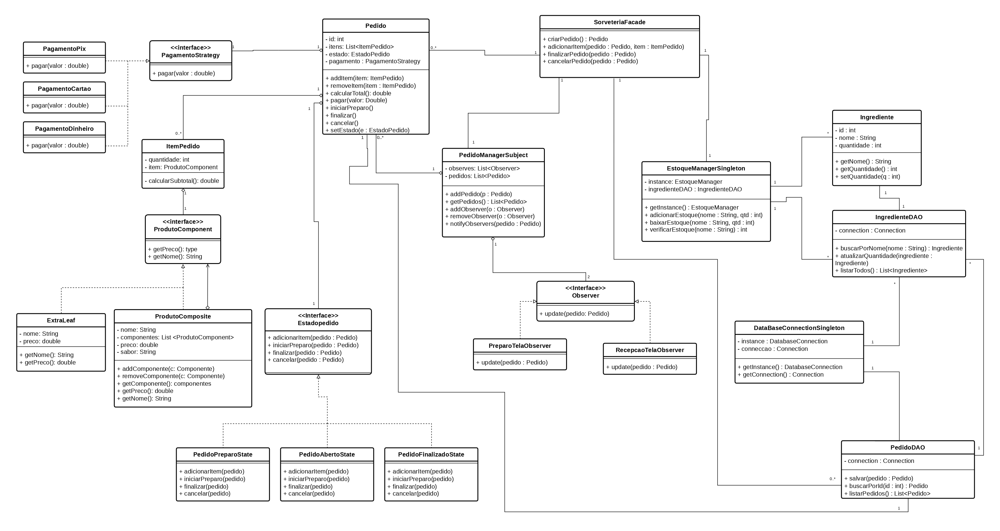
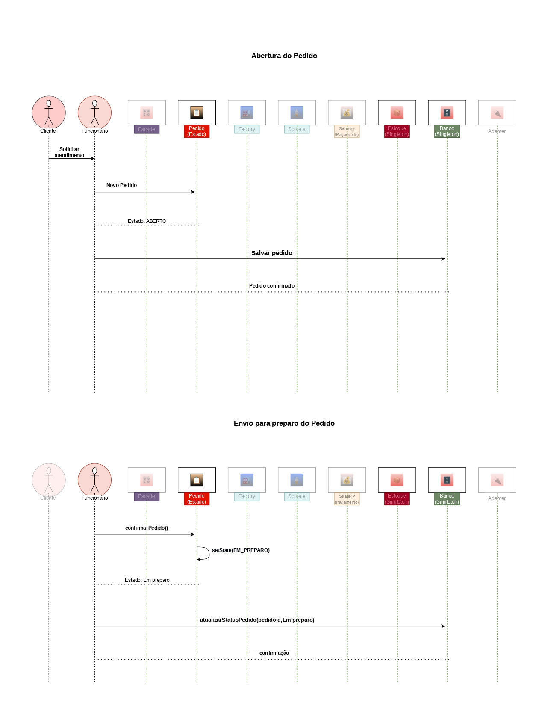
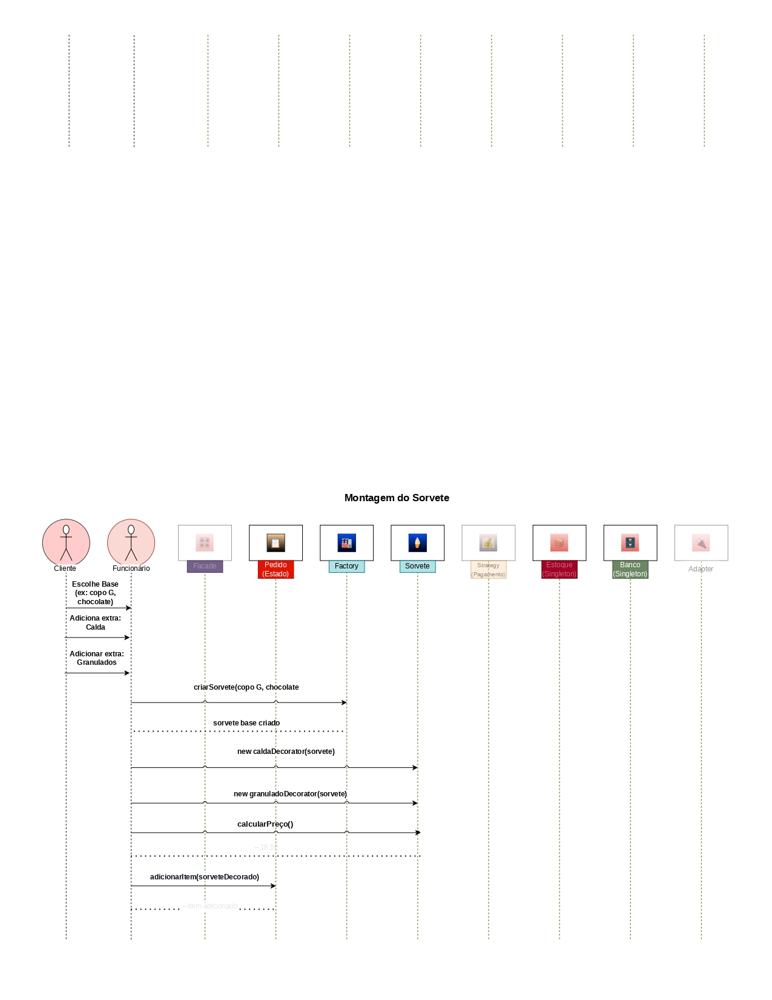
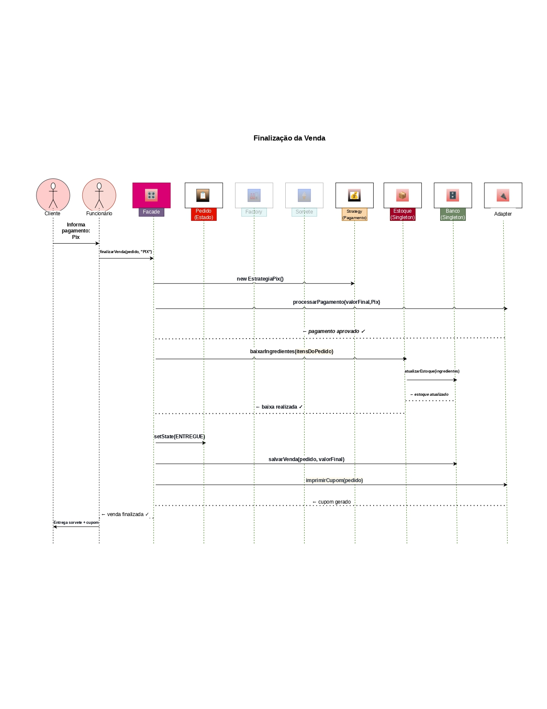

# Sistema de Gerenciamento de Sorveteria

> Projeto desenvolvido para a disciplina de **Análise e Projeto de Sistemas**, com foco na aplicação prática de Padrões de Projeto (Design Patterns) e conceitos de Programação Orientada a Objetos.

## Sumário

- [Demonstração](#️-demonstração)
- [Sobre o Projeto](#-sobre-o-projeto)
- [Funcionalidades](#-funcionalidades)
- [Tecnologias Utilizadas](#️-tecnologias-utilizadas)
- [Estrutura do Projeto](#-estrutura-do-projeto)
- [Banco de Dados](#️-banco-de-dados)
- [Como Executar](#️-como-executar)
- [Design Patterns Aplicados](#-design-patterns-aplicados)
- [Diagramas](#diagramas)
---

## Demonstração

> Demo do sistema em funcionamento:



---

## Sobre o Projeto

O sistema automatiza o funcionamento de uma sorveteria, permitindo que funcionários:

- Registrem e gerenciem pedidos
- Montem sorvetes personalizados (base + sabores + adicionais)
- Controlem o estoque de ingredientes
- Processem pagamentos (Pix, Cartão ou Dinheiro)
- Acompanhem o ciclo de vida de cada pedido em tempo real

---

## Funcionalidades

- **Realização de pedidos** — o cliente escolhe base, sabores e complementos; o funcionário registra as escolhas e o preço é calculado automaticamente
- **Montagem personalizada** — sorvetes compostos por tipos base (obrigatório), sabores (obrigatório) e múltiplos adicionais (opcional)
- **Gerenciamento de pedidos** — o recepcionista pode alterar ou cancelar pedidos em aberto
- **Ciclo de vida do pedido** — acompanhamento dos estados: Aberto → Em Preparo → Finalizado/Entregue
- **Processamento de pagamento** — suporte a Pix, Cartão e Dinheiro
- **Controle de estoque** — baixa automática de ingredientes ao finalizar um pedido; exibe quando a quantidade de um ingrediente está baixa no estoque
- **Notificações entre telas** — telas de recepção e preparo sincronizadas em tempo real via Observer

---

## Tecnologias Utilizadas

| Tecnologia      | Finalidade                        |
|-----------------|-----------------------------------|
| Java 24         | Linguagem principal               |
| JavaFX          | Interface gráfica                 |
| PostgreSQL      | Banco de dados relacional         |
| JDBC            | Conexão Java / PostgreSQL         |
| IntelliJ IDEA   | IDE de desenvolvimento            |
| Maven           | Gerenciamento de dependências     |

---

## Estrutura do Projeto

```
src/
└── main/
    ├── java/
    │   └── sorveteria/
    │       │   AppLauncher.java         # Ponto de entrada da aplicação
    │       │
    │       ├── banco/                   # Camada de persistência
    │       │       DataBaseConnectionSingleton.java
    │       │       EstoqueManagerSingleton.java
    │       │       IngredienteDAO.java
    │       │       PedidoDAO.java
    │       │
    │       ├── composite/               # Padrão Composite – montagem do sorvete
    │       │       ProdutoComponent.java
    │       │       ProdutoComposite.java
    │       │       ExtraLeaf.java
    │       │
    │       ├── facade/                  # Padrão Facade – ponto de entrada das operações
    │       │       SorveteriaFacade.java
    │       │
    │       ├── model/                   # Classes de domínio
    │       │       Pedido.java
    │       │       ItemPedido.java
    │       │       Ingrediente.java
    │       │       Base.java
    │       │       BaseSorvete.java
    │       │       Sabor.java
    │       │       SaborSorvete.java
    │       │       Adicional.java
    │       │
    │       ├── observer/                # Padrão Observer – notificações de status
    │       │       Observer.java
    │       │       PedidoManagerSubject.java
    │       │
    │       ├── state/                   # Padrão State – ciclo de vida do pedido
    │       │       EstadoPedido.java
    │       │       PedidoAbertoState.java
    │       │       PedidoPreparoState.java
    │       │       PedidoFinalizadoState.java
    │       │
    │       ├── strategy/               # Padrão Strategy – formas de pagamento
    │       │       PagamentoStrategy.java
    │       │       PagamentoPix.java
    │       │       PagamentoCartao.java
    │       │       PagamentoDinheiro.java
    │       │
    │       └── view/
    │           │   App.java             # Inicialização do JavaFX
    │           │
    │           └── controller/         # Controllers das telas FXML
    │                   MainController.java
    │                   MontagemController.java
    │                   PagamentoController.java
    │                   PedidosController.java
    │                   PreparoController.java
    │                   EstoqueController.java
    │
    └── resources/
        └── sorveteria/
            └── view/
                └── controller/         # Arquivos FXML das telas
```

---

## Banco de Dados

O esquema do banco está definido em **`schema.sql`**, na raiz do projeto. Execute-o no PostgreSQL antes de rodar a aplicação.

### Configuração da conexão

Edite as credenciais em `DataBaseConnectionSingleton.java`:

```java
private static final String URL      = "jdbc:postgresql://localhost:5432/sorveteria";
private static final String USER     = "seu_usuario";
private static final String PASSWORD = "sua_senha";
```

---

## ▷ Como Executar

### Pré-requisitos

- Java 17 ou superior instalado
- PostgreSQL rodando localmente
- IntelliJ IDEA (recomendado) ou outra IDE com suporte a JavaFX

### Passo a passo

1. **Clone o repositório**
   ```bash
   git clone https://github.com/seu-usuario/sorveteria.git
   cd sorveteria
   ```

2. **Configure o banco de dados**
   ```bash
   psql -U postgres -c "CREATE DATABASE sorveteria;"
   psql -U postgres -d sorveteria -f schema.sql
   ```

3. **Abra o projeto no IntelliJ IDEA**
    - `File → Open` → selecione a pasta do projeto
    - Aguarde a indexação e resolução de dependências

4. **Configure o JavaFX** _(se necessário)_
    - Caso as dependencias falhem, baixe JavaFx SDK
    - Adicione a pasta lib do SDK em `File → Project Structure → Libraries`
    - Inclua as VM options em `Run/Debug Configurations`:
      ```
      --module-path /caminho/para/javafx/lib --add-modules javafx.controls,javafx.fxml
      ```

5. **Execute a aplicação**
    - Rode a classe `AppLauncher.java`

---

## Design Patterns Aplicados

O sistema utiliza cinco padrões de projeto, cada um resolvendo um problema específico do domínio da sorveteria:

### Composite — Montagem do sorvete
**Pacote:** `sorveteria.composite`

A interface `ProdutoComponent` é implementada por `ProdutoComposite` (sorvete completo com múltiplos componentes) e por `ExtraLeaf` (adicionais). Isso permite montar sorvetes de forma hierárquica e calcular o preço total percorrendo recursivamente a árvore de componentes, sem que o código cliente precise distinguir entre um item simples e um composto.

### Strategy — Formas de pagamento
**Pacote:** `sorveteria.strategy`

Os métodos de pagamento (`PagamentoPix`, `PagamentoCartao`, `PagamentoDinheiro`) são encapsulados atrás da interface `PagamentoStrategy`. A classe `Pedido` recebe a estratégia em tempo de execução, permitindo trocar a forma de pagamento sem alterar nenhuma outra classe.

### State — Ciclo de vida do pedido
**Pacote:** `sorveteria.state`

O ciclo de vida do pedido é modelado por estados concretos (`PedidoAbertoState`, `PedidoPreparoState`, `PedidoFinalizadoState`), todos implementando a interface `EstadoPedido`. Cada estado define as operações permitidas naquele momento. Por exemplo, itens só podem ser adicionados enquanto o pedido está em aberto.

### Observer — Sincronização entre telas
**Pacote:** `sorveteria.observer`

`PedidoManagerSubject` notifica automaticamente os observadores registrados (`PedidosController` e `PreparoController`) sempre que um pedido é criado ou tem seu estado alterado. Isso mantém as telas sincronizadas sem acoplamento direto entre os controllers, executando seus métodos `recarregar`.

### Singleton — Gerenciadores únicos
**Pacote:** `sorveteria.banco`

`EstoqueManagerSingleton` e `DataBaseConnectionSingleton` garantem que exista apenas uma instância de cada gerenciador em toda a aplicação, evitando inconsistências no estoque e conexões duplicadas com o banco de dados. `SorveteriaFacade` também é implementada como singleton; os Controllers, que não são classes instanciadas, precisavam de uma referência única à Facade, o padrão garante que essa referência global exista.

### Facade — Interface simplificada
**Pacote:** `sorveteria.facade`

`SorveteriaFacade` expõe operações de alto nível (`criarPedido`, `adicionarItem`, `finalizarPedido`, `cancelarPedido`,...), encapsulando a lógica do sistema. Oculta dos controllers a complexidade de coordenar pedidos, estoque, pagamentos e acesso ao banco. Sua primeira instância é ao iniciar `App`.

---

## Diagramas

### Diagrama de Casos de Uso



---

### Diagrama de Classes



---

### Diagrama de Sequência




